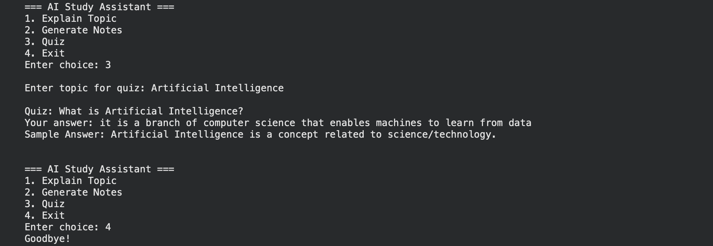

# 🤖 AI Study Assistant

This project is a simple command-line AI study assistant built using Python.  
It helps users learn any topic by generating explanations, notes, and quiz questions interactively.

---

## 🧠 Features

- Explain any topic
- Generate short notes
- Create quiz questions
- Menu-driven interactive system
- Dynamic topic-based responses

---

## ⚙️ How it works

The program takes user input and:
- Generates explanations for topics
- Provides structured notes
- Creates simple quiz questions

It uses basic Python logic and randomization to simulate an AI-like assistant.

---

## 🖼️ Output Screenshot



---

## 💻 Code

```python
import random

def explain_topic():
    topic = input("\nEnter topic: ")
    print(f"\nExplanation of {topic}:")
    print(f"{topic.capitalize()} is an important concept used in various real-world applications.")
    print(f"It helps in understanding key principles and improves problem-solving ability.\n")

def generate_notes():
    topic = input("\nEnter topic: ")
    print(f"\nShort Notes on {topic}:")
    print(f"- Definition of {topic}")
    print(f"- Key concepts related to {topic}")
    print(f"- Real-world applications of {topic}")
    print(f"- Importance in academics and industry\n")

def generate_quiz():
    topic = input("\nEnter topic for quiz: ")
    
    questions = [
        (f"What is {topic}?", f"{topic} is a concept related to science/technology."),
        (f"Why is {topic} important?", "It helps solve real-world problems."),
        (f"Give one application of {topic}.", "Used in various practical fields.")
    ]
    
    q, ans = random.choice(questions)
    user_ans = input(f"\nQuiz: {q}\nYour answer: ")
    
    print(f"Sample Answer: {ans}\n")

def main():
    while True:
        print("\n=== AI Study Assistant ===")
        print("1. Explain Topic")
        print("2. Generate Notes")
        print("3. Quiz")
        print("4. Exit")
        
        choice = input("Enter choice: ")

        if choice == "1":
            explain_topic()
        elif choice == "2":
            generate_notes()
        elif choice == "3":
            generate_quiz()
        elif choice == "4":
            print("Goodbye!")
            break
        else:
            print("Invalid choice\n")

main()
```

---

## 🛠️ Technologies Used

- Python  
- Random module  

---

## 🚀 Future Improvements

- Integrate real AI APIs (like OpenAI)
- Add graphical user interface (GUI)
- Store user history and progress
- Improve quiz system with scoring and levels

---
